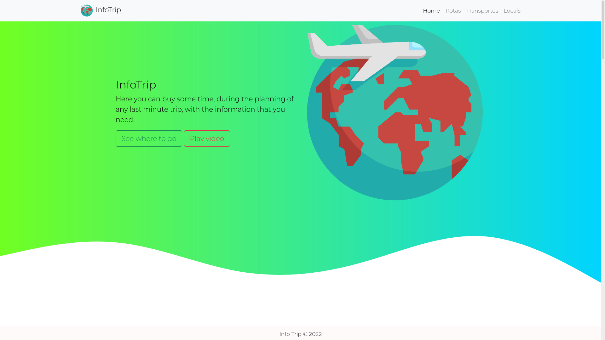

# infostrip-app
[](LICENSE) [](https://www.oracle.com/java/technologies/downloads/#java17) [](https://nodejs.org/en/download/) [](https://www.npmjs.com/package/npm/v/8.5.0)

## Description
This is a project for the N2 grade from the 1st bimester from Programming Language III subject of FESA (Faculdade Engenheiro Salvador Arena). If you are not familiar with this name, you can check more information about <a href="http://faculdadesalvadorarena.org.br" target="_blank">right here</a>.

## Visuals


## Installation

First of all, simply clone this project in your machine with:
```console
git clone https://github.com/infostrip/infostrip-app.git
```
or via ssh if you prefer.
```console
git clone git@github.com:infostrip/infostrip-app.git
```
Ps: Make sure you already have the ssh keys set up in your machine, otherwise, you will not be able to complete the `git clone`.

### Next step:

> You must verify the versions of node and npm installed in your machine before going on.
```console
npm install
```
and then,
```console
cordova platform add browser
```
you can also add android platform by chaging `browser` to `android`.

After this, you can just run
```console
cordova run browser
```
and the window will pop-up in you screen.

## Support
From us with &#128156;.

## Contributing
<p align="center">
  <a href="https://github.com/infostrip/infostrip-app/graphs/contributors">
    
  </a>
</p>

## License
<p align="center">
  Licensed under the <a href="LICENSE">MIT License</a> policy. Copyright © 2022 InfosTrip.
</p>
